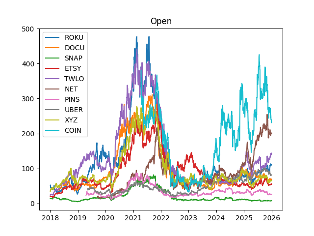
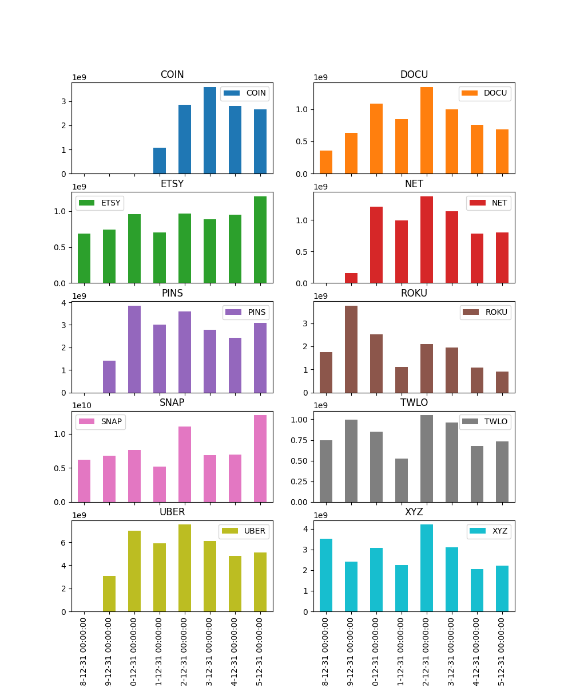
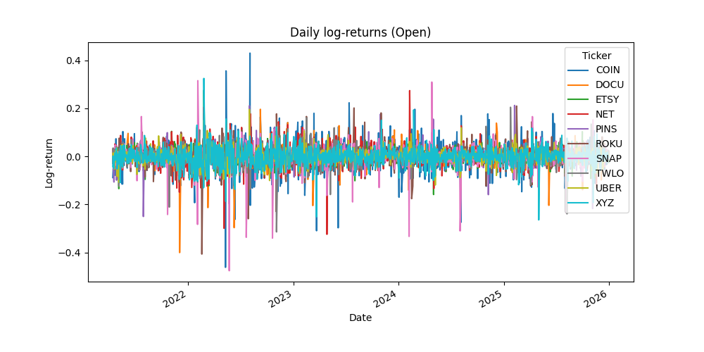
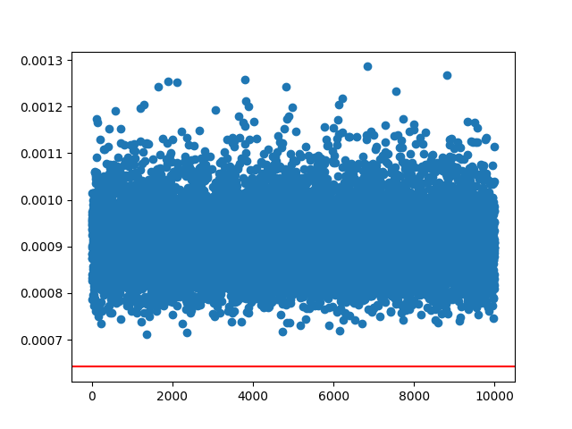
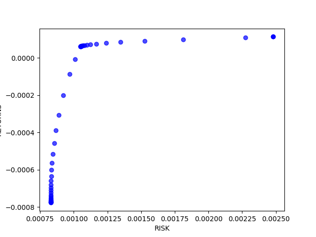
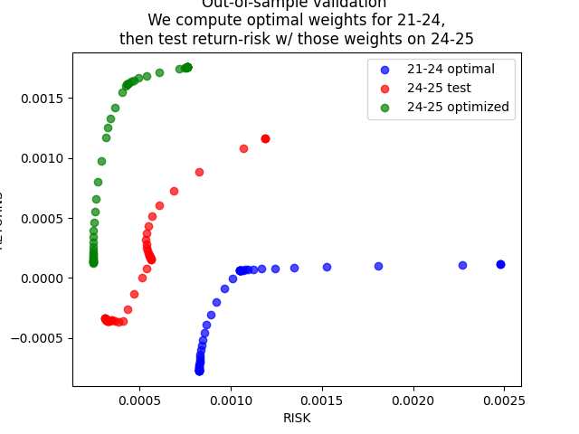
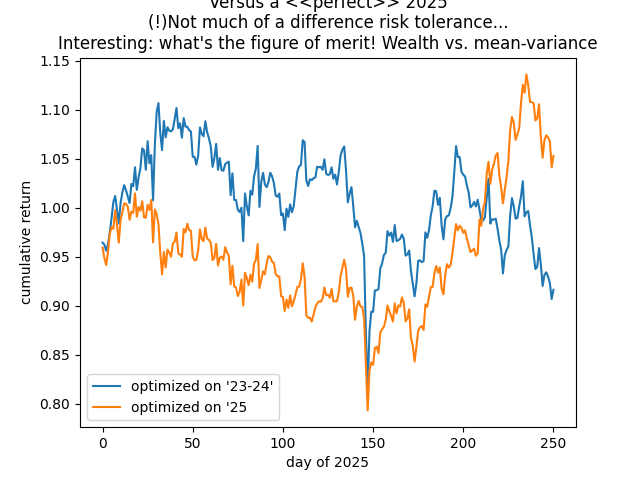

# Portfolio Optimization Challenge

Mean-variance portfolio optimization using convex quadratic programming.

## Data

**Tickers:** ROKU, DOCU, SNAP, ETSY, TWLO, NET, PINS, UBER, XYZ, COIN
**Period:** 2018-01-01 to 2026-01-01
**Source:** yfinance (adjusted prices)

---

## 0. Data Download & Inspection

**File:** [`0_download.py`](0_download.py)

- Downloads daily OHLCV data via yfinance (lines 9-16)
- Inspects the MultiIndex DataFrame structure (lines 25-43)
- Plots price series for all tickers (lines 46-67)

- Plots yearly volume per ticker (lines 75-79)

---

## 1. First Optimization

**File:** [`1_optimize.py`](1_optimize.py)

**Returns definition:** Log returns $r_t = \log(P_t / P_{t-1})$ (line 43)

**Estimation:** Mean $\hat{\mu}$ and covariance $\hat{\Sigma}$ from historical data (lines 51-54)

**Random exploration:** Sample 10,000 random portfolios and compute their cost for different risk tolerances $q$ (lines 66-74)

**Quadratic Program:** Solve $\min_w \; w^T \Sigma w - q \mu^T w$ subject to $\sum w_i = 1$, $w \geq 0$ using CVXPY/SCS (lines 80-100)

**Metrics:** Expected return $\mu^T w$ (line 116) and volatility $\sqrt{w^T \Sigma w}$ (line 119)

---

## 2. Modular Pipeline & Out-of-Sample Validation

**File:** [`2_modules.py`](2_modules.py)

**Functions:**
- `optimize_portfolio(mu, sigma, q)` - QP solver (lines 27-51)
- `metrics(mu, sigma, w)` - return and volatility (lines 55-64)
- `get_mu_sigma(db, time_window, start_date, end_date)` - estimate $\mu$, $\Sigma$ for a date range (lines 68-113)

**Efficient Frontier:** Sweep over risk tolerances $q \in [10^{-3}, 10^2]$ (lines 119-133)

**Out-of-sample validation:**
- Train on 2021-2024, test on 2024-2025 (lines 144-164)
- Compare: (blue) trained weights, (red) tested with old weights, (green) re-optimized on test period

**Cumulative Wealth Curve:** How much you gain in 2025 using the trained portfolio vs the "perfect" re-optimized one (lines 188-210)

---

## 3. Rolling Rebalancing (WIP)

**File:** [`3_rolling.py`](3_rolling.py)

**Idea:** Instead of optimizing once, use a rolling window:
1. Observe market for `lookback_months` (e.g., 3 months)
2. Optimize portfolio weights
3. Invest for `invest_months` (e.g., 1 month)
4. Repeat, sliding the window forward

**Implementation:** `rolling_rebalance()` function (lines 116-171)

This is work in progress - the framework is set up but further analysis is needed.

---

## Experimental: Jupyter Notebooks

The folder [`untested_tutorials/`](untested_tutorials/) contains Jupyter notebook versions of each script, converted directly from the Python files with comments as markdown cells. These are provided for convenience but have not been tested independently.

- [`0_download.ipynb`](untested_tutorials/0_download.ipynb)
- [`1_optimize.ipynb`](untested_tutorials/1_optimize.ipynb)
- [`2_modules.ipynb`](untested_tutorials/2_modules.ipynb)
- [`3_rolling.ipynb`](untested_tutorials/3_rolling.ipynb)
